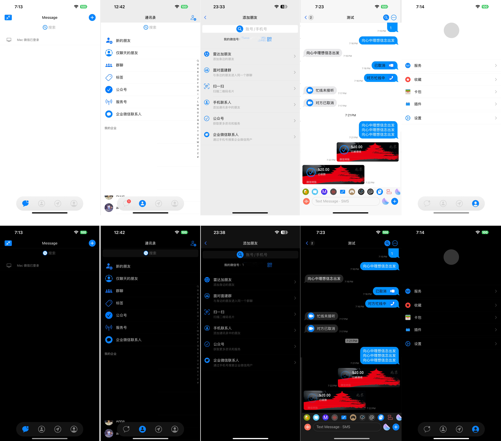
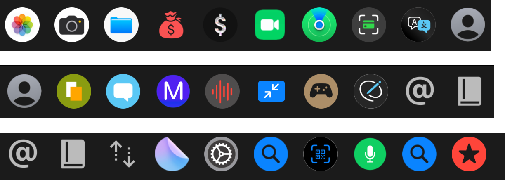
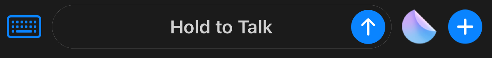
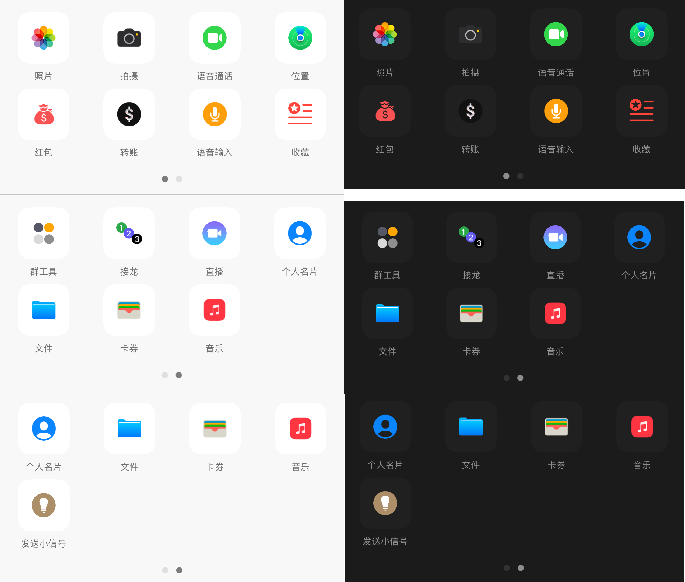
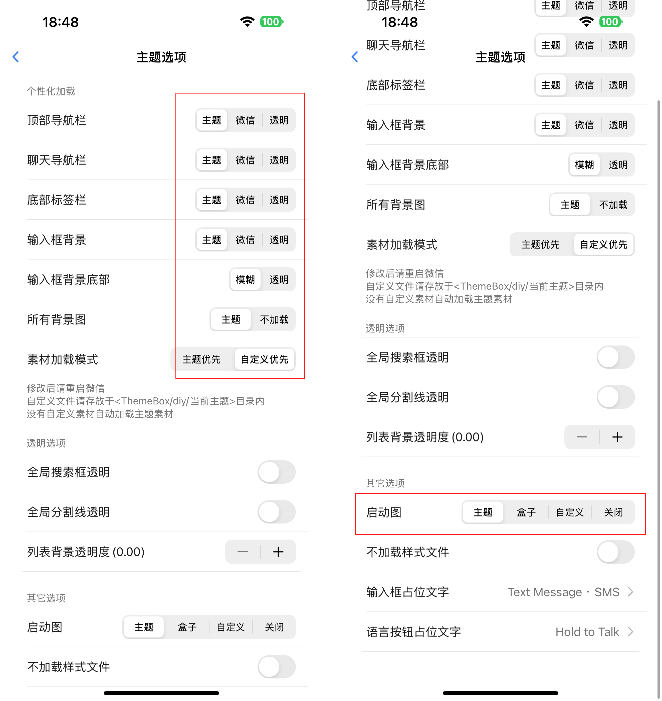
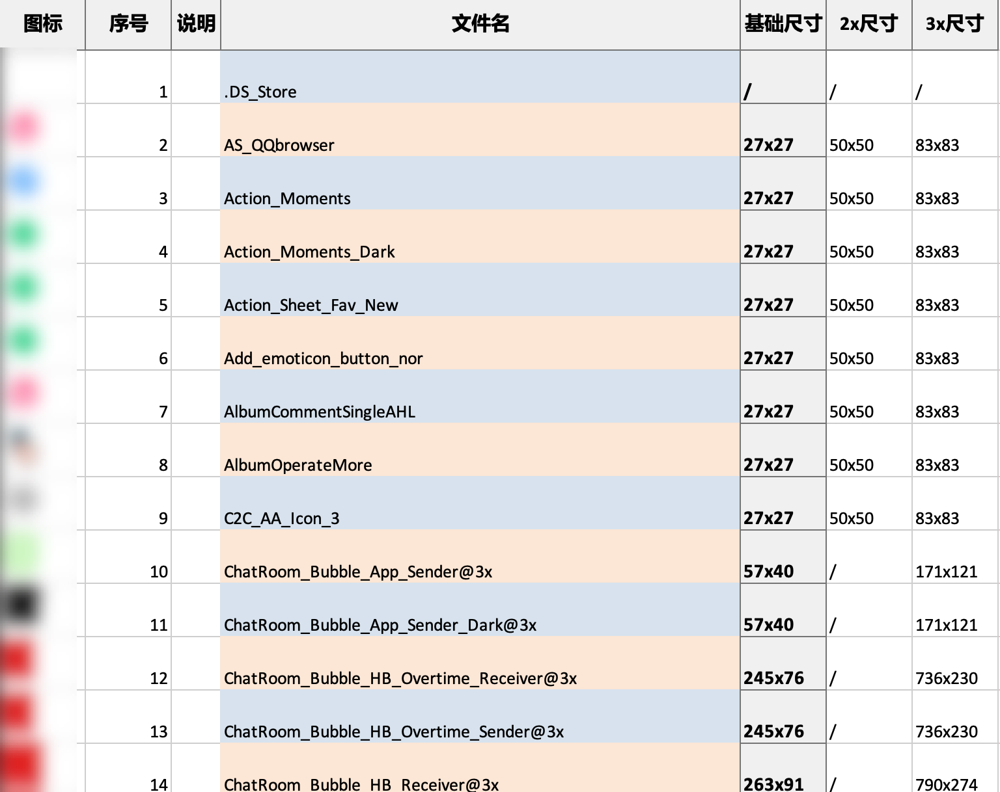
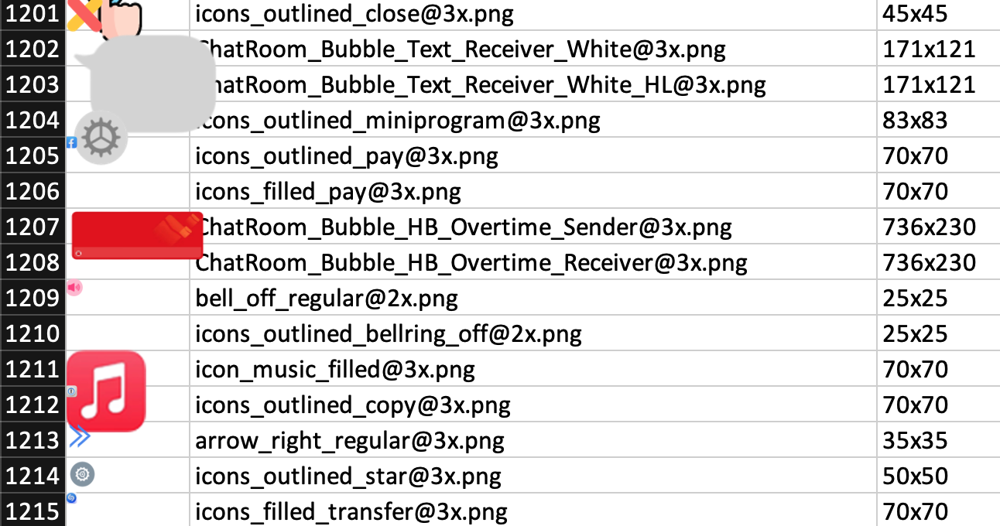
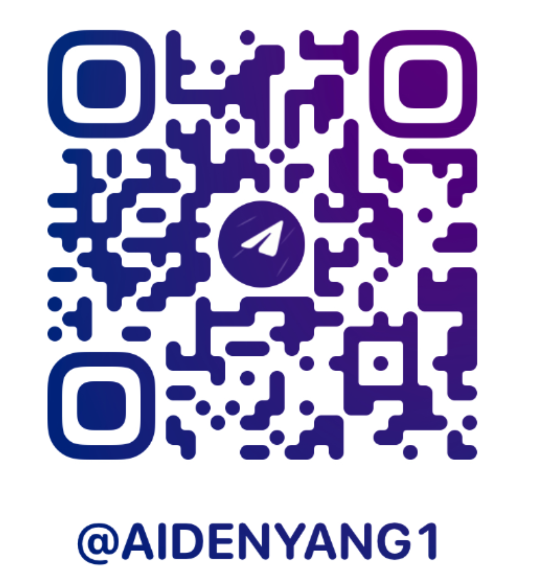

# 简介
  &nbsp;&nbsp;&nbsp;&nbsp;&nbsp;&nbsp;&nbsp;&nbsp; 一款基于 Apple 系统图标 的类 iMessage 风格 WeChat 主题，为 Themebox 插件专门适配，旨在提供简约而高效的视觉体验。主题覆盖了 iMessage 常见图标，并对部分 WeChat 第三方插件图标进行了专门设计和优化。支持浅色模式和深色 OLED 模式自由切换，整体风格以蓝色为主调，保持一二级界面干净的同时，为功能菜单增加色彩点缀兼具简洁与实用。主题文件包含完整的界面适配及多种红包、转账气泡样式，并附带可供参考的 Sketch 项目文件。持续更新，欢迎参与协作，共同完善主题设计。
 <br><br>

<br>
<div align="center">
  （界面随更新、完善和优化可能变化）
</div> <br>


<br>


 <br><br>
  &nbsp;&nbsp;&nbsp;&nbsp;&nbsp;&nbsp;&nbsp;&nbsp; 目前该主题可能仍有部分遗漏的待优化和解决的问题，欢迎发 `issue` 反馈。如果你有兴趣和经验愿意共同维护和完善该项目，也欢迎通过该页最底部电报联系。


   <br><br><br>
  
# 必看说明
- 基于 `Themebox(兼容1.0.5以上）` 主题盒子插件和微信 `8.0.54` 版本适配。（其他主题插件使用不保证兼容性，请自行调整优化）
- 基于 `Apple Developer` 官方系统图标库制作。
- `Sketch` 项目工程文件内素材命名可能会随着 ` 主题插件 ` 和 ` WeChat ` 版本更新而变化。(会第一时间更新和完善。也欢迎主动提 ` issue `。)
- 免费分享，禁止二次打包售卖。
- 请多 `支持！支持！支持` 主题插件作者和原创主题作者！
- 部分内容如：`头像修改`，`气泡长按工具栏部分操作`等未做大设计，主要是为了`去繁从简`，避免太花里胡哨，但如何设置在`项目文件中有标注`，需要的话可以自行按照说明设计。
- 部分位置图标`引用同一命名`，无法单独设置，可能会出现部分位置图标有文本不对应的问题。<br>(已最大限度保证显示合理性，避免过于突兀，如有强迫症请自行调整设计或关闭该图标指向的功能）

  
  <br><br><br>
  

# 特性
- ✅ 类 `iMessage` 风，以蓝色为主调。简约干净。
- ✅ 含有 `xml` 文件
- ✅ 深色纯 OLED 模式（节省电量）
- ✅ 适配常用界面
- ✅ 输入栏适配优化
- ✅ 菜单栏优化
- ✅ 高清晰度
- ✅ 部分图标矢量化
- ✅适配微信助手工具栏
- ✅适配第三方插件，并为`“黄白助手”`、`“Misaka”`单独设计图标。
- [ ] 更多界面的深度适配
- [ ] 不拉伸气泡适配
- [ ] 主题自动监测更新 `dylib` 插件
- [ ] 微信内红包、转账气泡选择 `dylib` 插件
- [ ] 命名方式统计表
   <br><br><br>

# 特别设计适配
## 1. 微信助手工具栏


## 2. 输入栏



## 3.官方底栏


  <br><br><br> 
# 主题使用说明
&nbsp;&nbsp;&nbsp;&nbsp;&nbsp;&nbsp;&nbsp;&nbsp; 下载主题文件压缩包（里面包含主题文件夹和可供替换的红包转账气泡）。
1. 确保你已经激活 Themebox 。
2. 将解压后的主题文件夹“`WeChat-iMessage-Themebox`”内的所有文件和文件夹全选后（不要直接拷贝文件夹）导入你的微信文件夹中`“themebox-diy-官方主题文件夹”`里。
3. 建议前往 `微信` - `设置` - `通用` - `字体大小` 为 `标准以下`。并将 `Themebox` 中按照如下设置以达到主题显示最佳适配效果 ：

4. 设置完成后，重启微信，以使主题生效。


 <br><br><br>

# 转账红包气泡计划
&nbsp;&nbsp;&nbsp;&nbsp;&nbsp;&nbsp;&nbsp;&nbsp; 本项目会不定期更新一些制作的新的红包、转账的气泡封面，欢迎关注。<br>
> - (部分素材可能涉及版权问题，仅供素材学习交流，免费分享，禁止盈利和二次打包！)
> - (部分素材可能涉及版权问题，仅供素材学习交流，免费分享，禁止盈利和二次打包！)
> - (部分素材可能涉及版权问题，仅供素材学习交流，免费分享，禁止盈利和二次打包！)

<br>目前已推出和计划制作的封面有：
- ✅ 京卡银行卡封面（默认）
  <br> 
- ✅ `MESH` 黑卡封面
<br> 
- [ ] 2025 年春节蛇年封面


<br><br><br>
# 其他文件夹
## 1. 官方 Assets 文件夹
 &nbsp;&nbsp;&nbsp;&nbsp;&nbsp;&nbsp;&nbsp;&nbsp; `WeChat 8.0.50` 版本的 `Assets` 素材解包文件夹。
  里面涵盖理所有经 `Xcode` 文件编译后的 `Assets` 资源文件。仅供参考，大部分图标的命名方式有由主题插件制作者定义命名，但有部分素材命名方式仍然未变。
  （素材命名方式可能会随着 WeChat 版本和主题插件更新而变化）

 <br><br><br>
## 2. 完整 Sketch 项目文件
  &nbsp;&nbsp;&nbsp;&nbsp;&nbsp;&nbsp;&nbsp;&nbsp; 制作该套主题时的 `Sketch` 项目完整文件，提供参考和学习。也可以在此项目文件的基础上进行继续制作和完善。提交 `PR` 或者电报联系我分享你的项目文件。审核通过后此项目将更新。同时致谢和合作者列将表示对你的感谢。
  <br>完整`Sketch`文件页面树：<br>
```
主题盒子适配说明
├── 头像修改
├── 背景
│   ├── 主题盒子微信底栏背景
│   ├── 自定义微信界面顶栏
│   ├── 聊天窗口顶栏背景
│   ├── 聊天窗口中间背景
│   ├── 聊天窗口底部背景
│   └── 聊天窗口输入框样式背景
├── 全局
├── 转账红包气泡
├── 杂项
├── 主界面
│   ├── 消息列表页
│   ├── 通讯录页
│   ├── 发现页
│   └── 我的页面
├── 聊天页面
│   ├── 示意图
│   ├── 昵称顶栏操作
│   ├── 气泡长按功能区（未全彩设计，避免繁杂）
│   ├── 输入栏区
│   ├── 微信助手插件工具栏区
│   └── 官方菜单工具栏
└── 好友资料页
    ├── 性别显示
    └── 语音视频通话

........更多未列出项
```

<br><br>


项目文件包含：
- 全局背景设置。
- Themebox 适配指南。
- WeChat 所有页面分类整理。
- 主题插件所有图标的命名设置。
- 素材导出说明。
- 转账红包气泡制作页。
- 图标素材矢量化。
  


 <br><br><br>
 
## 3. 红包🧧、转账气泡制作
  &nbsp;&nbsp;&nbsp;&nbsp;&nbsp;&nbsp;&nbsp;&nbsp; 项目红包转账气泡背景的制作 `PS` 项目文件。 <br>
&nbsp;&nbsp;&nbsp;&nbsp;&nbsp;&nbsp;&nbsp;&nbsp; 包含： 
- 气泡尺寸 `（800 x 250）`
- 底部圆角卡片背景
- 自定义背景设计的剪贴蒙版
 <br><br>
如果你想要 `自定义设计红包转账气泡背景`，可基于此项目文件进行初步设计你的个性化转账红包气泡。简单设计完成后进入 `Sketch` 根据 `Sketch` 项目文件内的说明批量命名和导出。
 <br><br>
若只使用 PS 导出，请确保导出所有以下命名的 png 格式图片：
（图片已经调整尺寸大小，命名方式直接加 `@3x` 命名，小机型设备会自动缩放） <br><br>
- `ChatRoom_Bubble_HB_Sender@3x` （发送方-普通状态）
- `ChatRoom_Bubble_HB_Sender_Dark@3x` （发送方-普通状态-深色模式）
- `ChatRoom_Bubble_HB_Sender_Handled@3x` （发送方-接收状态）
- `ChatRoom_Bubble_HB_Sender_Handled_Dark@3x` （发送方-接受状态-深色模式）
- `ChatRoom_Bubble_HB_Receiver@3x` （接收方-普通状态）
- `ChatRoom_Bubble_HB_Receiver_Dark@3x` （接收方-普通状态-深色模式）
- `ChatRoom_Bubble_HB_Receiver_Handled@3x` （接收方-接收状态）
- `ChatRoom_Bubble_HB_Receiver_Handled_Dark@3x` （接收方-接受状态-深色模式）
- `ChatRoom_Bubble_HB_Overtime_Sender@3x` （发送方-过期状态）
- `ChatRoom_Bubble_HB_Overtime_Sender_Dark@3x` （发送方-过期状态-深色模式）
- `ChatRoom_Bubble_HB_Overtime_Receiver@3x` （接受方-过期状态）
- `ChatRoom_Bubble_HB_Overtime_Receiver_Dark@3x` （接受方-过期状态-深色模式）


 <br><br><br>
## 4. 部分素材导出
  &nbsp;&nbsp;&nbsp;&nbsp;&nbsp;&nbsp;&nbsp;&nbsp; 项目部分制作的素材导出，方便没有 `Sketch` 的用户在其他主题或者地方使用素材。
 （会不断更新）
  <br><br><br>

## 5. 辅助脚本程序
  &nbsp;&nbsp;&nbsp;&nbsp;&nbsp;&nbsp;&nbsp;&nbsp; 制作本主题时的辅助 `Python` 脚本文件。可快速提取官方 `WeChat` 包里经过解压后的 `Assets` 文件夹的所有文件的图标、文件名、尺寸大小，以及帮助你快速将他人的主题包里使用相同图标但命名不同的文件按照图标和文件名统一分类输出为 `excel` 表。

包含：
 <br>
### 5.1. 1. 官方 Assets 分类提取程序
 &nbsp;&nbsp;&nbsp;&nbsp;&nbsp;&nbsp;&nbsp;&nbsp; 用于参考学习官方 `Assets` 包。
<br>
功能包含：
  - 将文件夹下同时含有 `@2x` 和 `@3x` 的同名文件分类为一行输出统计到 excel 表中。 
  - 仅含有 `@2x` 或 `@3x` 的文件保持 `@2x` 或 `@3x` 命名输出一行。
  - 文件名图标预览。
  - 计算所有图标的 `1x` 、`2x` 、`3x` 尺寸大小。（方便你基于官方素材进行设计. 使用 `Sketch` 等原型设计工具时只需设计基础样式，导出时设置 `@2x` 和 `@3x` 即可自动生成 `2x` 和 `3x` 文件）
  - 按照名称顺序排序




 <br><br><br>
### 5.2. 2. 未封包的主题素材分类程序
   &nbsp;&nbsp;&nbsp;&nbsp;&nbsp;&nbsp;&nbsp;&nbsp; 用于在命名大幅度更新或者变更后快速摸索命名规则。 
<br>
功能包含：
- 识别图片唯一 `哈希值`，区分相同素材但命名不同的文件到同一栏。（适用于使用标准作图软件如 `Sketch`、`figma` 或者 `Principle` 等导出的素材。非标准流程制作的素材可能会出现分类问题）
- 文件名图标预览。
- 计算所有图标的 `1x` 、`2x` 、`3x` 尺寸大小。（方便你基于官方素材进行设计）。

    



 <br><br><br>

 # 加入协作一起维护
 &nbsp;&nbsp;&nbsp;&nbsp;&nbsp;&nbsp;&nbsp;&nbsp; 一个人的力量是薄弱的，大家一起努力可以维持本项目的生命周期的同时，也可以不断完善 `命名统计` 和 `常见问题`，消除信息差。
- 共同协作：
如果你会使用 `Sketch`、`Figma`、`PS` 等原型设计软件, 并有兴趣参与该项目，请电报联系我，需要使用 `Sketch` 或者 `Figma` 共同协作。
- 提供帮助反馈：
  即使不会作图，但能够分享命名规则和常见问题的解决方案，一起完善自定义主题文档和该项目。欢迎提交 `PR` 、发起 `issue` 。
  <br>
  欢迎加入维护、完善、更新！
<div align="center"></div>
<br><br><br>

# 致谢和合作者
   &nbsp;&nbsp;&nbsp;&nbsp;&nbsp;&nbsp;&nbsp;&nbsp; 从想到自己完善和优化一份主题开始到基本版本落定耗时三天。<br>
 &nbsp;&nbsp;&nbsp;&nbsp;&nbsp;&nbsp;&nbsp;&nbsp; 这期间经历了了解 `Assets` 文件的解包、图标的命名、主题插件的区别、`WeChat` 版本的差异、为什么图标不生效、尺寸适配问题、官方命名和主题插件制作者们的命名方式的区别、熬夜改图、作图、收到群友的帮助、讲解和鼓励等等过程。<br>  &nbsp;&nbsp;&nbsp;&nbsp;&nbsp;&nbsp;&nbsp;&nbsp; 这份主题还存在很多待完善和优化的地方，会不断维护和更新的直到哪天完全不能自定义了。
发出来的目的也不是因为这份主题多好，只是提供了一个后期所有想要自己 diy 主题的一个参考项目。<br>  &nbsp;&nbsp;&nbsp;&nbsp;&nbsp;&nbsp;&nbsp;&nbsp; 帮助希望自己 diy 主题的人。能够自定义离不开主题插件作者们的 `逆向努力`，也请大家多支持作者的原创主题。
<br>
## 1. 感谢

插件：
- Themebox 作者 `懒猫`
  
电报：
- @ `v2666`
- @ `atdtt`
- @ `猴劲秋`
- @ `Tocrates D`

 <br><br><br> <br><br>
