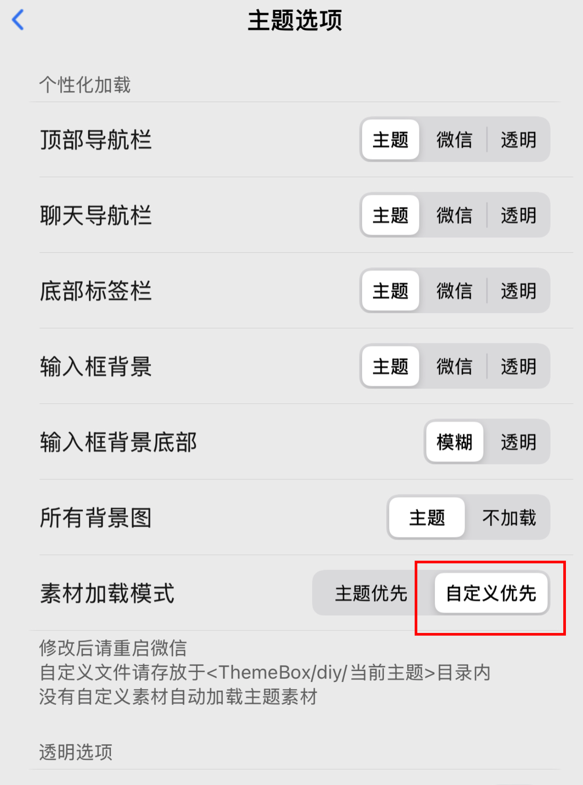

# 简介
  &nbsp;&nbsp;&nbsp;&nbsp;&nbsp;&nbsp;&nbsp;&nbsp;一个基于系统图标的WeChat类 iMessage 主题，采用简约的风格适配。覆盖了 iMessage 常见的图标。支持深色模式纯 Oled 背景显示以节省 Oled 屏幕的 iPhone 的电量消耗。适配和优化持续更新，跟随 WeChat 和主题插件的版本不断进行优化和更新。
   

 

（界面随更新、完善和优化可能变化）

   
  &nbsp;&nbsp;&nbsp;&nbsp;&nbsp;&nbsp;&nbsp;&nbsp;目前该主题项目还有很多需要更加精细的优化，如果你有兴趣和经验愿意共同维护和完善该项目，欢迎联系我。

      
  
# 必看说明
- 基于 `"Themebox"` 插件和微信 `8.0.54` 版本适配。
- 基于 `Apple Developer` 官方系统图标库制作。
- 项目工程文件内素材命名可能会随着`主题插件`和 `WeChat` 版本更新而变化。会第一时间根据反馈进行更新和完善。欢迎提 `issue`。
- 基于群友分享的包优化。
- 设计过程可能有遗漏，反馈问题请礼貌。
- 本项目不是引战项目，只是为了提供一个共同维护的手册和参考。请多`支持！支持！支持`主题插件作者和原创主题作者！

  
     
  

# 特性
✅ 类 iMessage 风，以蓝色为主调。简约干净。
✅ 含有 xml 文件
✅ 适配常用界面
✅ 输入栏图标优化
✅ 菜单栏优化
✅ 深色模式 Oled 纯黑（节省电量）
✅ 优化低像素图片素材
✅ 更新部分图片素材
- [ ] 命名方式统计表
- [ ] 主题自动监测更新dylib插件
- [ ] 三级界面的深度适配
- [ ] 不拉伸气泡适配
      

# 转账红包气泡计划
&nbsp;&nbsp;&nbsp;&nbsp;&nbsp;&nbsp;&nbsp;&nbsp;本项目会不定期更新一些制作的新的红包、转账的气泡封面，欢迎关注。  目前已推出和计划制作的封面有：
✅ 京卡银行卡封面
    
- [ ] 2025年春节蛇年封面
- [ ] `MESH`黑卡封面

   
  
# 主题使用说明
## 1. WeChat-iMessage-Themebox
&nbsp;&nbsp;&nbsp;&nbsp;&nbsp;&nbsp;&nbsp;&nbsp;是主题完整的文件夹，在激活 Themebox 后请直接导入微信文件夹中“themebox-diy-themebox官方主题文件夹”里。在 themebox 中启用 diy 素材加载杀掉后台重新启动微信以生效。

    

    

# 其他文件夹
## 1. 官方Assets文件夹
 &nbsp;&nbsp;&nbsp;&nbsp;&nbsp;&nbsp;&nbsp;&nbsp;`WeChat 8.0.50` 版本的 `Assets` 素材解包文件夹。
  里面涵盖理所有经 `Xcode` 文件编译后的 `Assets` 资源文件。仅供参考，大部分图标的命名方式有由主题插件制作者定义命名，但有部分素材命名方式仍然未变。
  （素材命名方式可能会随着 WeChat 版本和主题插件更新而变化）

    
## 2. 完整Sketch项目文件
  &nbsp;&nbsp;&nbsp;&nbsp;&nbsp;&nbsp;&nbsp;&nbsp;制作该套主题时的 `Sketch`项目完整文件，提供参考和学习。也可以在此项目文件的基础上进行继续制作和完善。提交`PR`或者电报联系我分享你的项目文件。审核通过后此项目将更新。同时致谢和合作者列将表示对你的感谢。
项目文件包含：
  
- 全局背景设置。
- Themebox 适配指南。
- WeChat所有页面分类整理。
- 主题插件所有图标的命名设置。
- 素材导出说明。
- 转账红包气泡制作页。
- 图标素材矢量化。
  

    
 
## 3. 红包🧧、转账气泡制作
  &nbsp;&nbsp;&nbsp;&nbsp;&nbsp;&nbsp;&nbsp;&nbsp;项目红包转账气泡背景的制作`PS`项目文件。  
&nbsp;&nbsp;&nbsp;&nbsp;&nbsp;&nbsp;&nbsp;&nbsp;包含： 
- 气泡尺寸 `（800 x 250）`
- 底部圆角卡片背景
- 自定义背景设计的剪贴蒙版
   
如果你想要`自定义设计红包转账气泡背景`，可基于此项目文件进行初步设计你的个性化转账红包气泡。简单设计完成后进入 `Sketch` 根据 `Sketch` 项目文件内的说明批量命名和导出。
   
若只使用 PS 导出，请确保导出所有以下命名的 png 格式图片：
（图片已经调整尺寸大小，命名方式直接加 `@3x` 命名，小机型设备会自动缩放）   
- `ChatRoom_Bubble_HB_Sender@3x` （发送方-普通状态）
- `ChatRoom_Bubble_HB_Sender_Dark@3x` （发送方-普通状态-深色模式）
- `ChatRoom_Bubble_HB_Sender_Handled@3x` （发送方-接收状态）
- `ChatRoom_Bubble_HB_Sender_Handled_Dark@3x` （发送方-接受状态-深色模式）
- `ChatRoom_Bubble_HB_Receiver@3x` （接收方-普通状态）
- `ChatRoom_Bubble_HB_Receiver_Dark@3x` （接收方-普通状态-深色模式）
- `ChatRoom_Bubble_HB_Receiver_Handled@3x` （接收方-接收状态）
- `ChatRoom_Bubble_HB_Receiver_Handled_Dark@3x` （接收方-接受状态-深色模式）
- `ChatRoom_Bubble_HB_Overtime_Sender@3x` （发送方-过期状态）
- `ChatRoom_Bubble_HB_Overtime_Sender_Dark@3x` （发送方-过期状态-深色模式）
- `ChatRoom_Bubble_HB_Overtime_Receiver@3x` （接受方-过期状态）
- `ChatRoom_Bubble_HB_Overtime_Receiver_Dark@3x` （接受方-过期状态-深色模式）

    
## 4. 部分素材导出
  &nbsp;&nbsp;&nbsp;&nbsp;&nbsp;&nbsp;&nbsp;&nbsp;项目部分制作的素材导出，方便没有`Sketch`的用户在其他主题或者地方使用素材。
 （会不断更新）
     

## 5. 辅助脚本程序
  &nbsp;&nbsp;&nbsp;&nbsp;&nbsp;&nbsp;&nbsp;&nbsp;制作本主题时的辅助 `Python` 脚本文件。可快速提取官方 `WeChat` 包里经过解压后的 `Assets` 文件夹的所有文件的图标、文件名、尺寸大小，以及帮助你快速将他人的主题包里使用相同图标但命名不同的文件按照图标和文件名统一分类输出为 `excel` 表。

包含：
  
### 5.1. 1.官方Assets 分类提取程序
 &nbsp;&nbsp;&nbsp;&nbsp;&nbsp;&nbsp;&nbsp;&nbsp;用于参考学习官方 `Assets` 包。
 
功能包含：
  - 将文件夹下同时含有 `@2x` 和 `@3x` 的同名文件分类为一行输出统计到 excel 表中。 
  - 仅含有 `@2x` 或 `@3x` 的文件保持 `@2x` 或 `@3x` 命名输出一行。
  - 文件名图标预览。
  - 计算所有图标的 `1x` 、`2x` 、`3x` 尺寸大小。（方便你基于官方素材进行设计.使用`Sketch`等原型设计工具时只需设计基础样式，导出时设置`@2x`和`@3x`即可自动生成`2x`和`3x`文件）
  - 按照名称顺序排序

    
### 5.2. 2.未封包的主题素材分类程序
   &nbsp;&nbsp;&nbsp;&nbsp;&nbsp;&nbsp;&nbsp;&nbsp;用于在命名大幅度更新或者变更后快速摸索命名规则。 
 
功能包含：
- 识别图片唯一`哈希值`，区分相同素材但命名不同的文件到同一栏。（适用于使用标准作图软件如 `Sketch`、`figma` 或者`Principle`等导出的素材。非标准流程制作的素材可能会出现分类问题）
- 文件名图标预览。
- 计算所有图标的 `1x` 、`2x` 、`3x` 尺寸大小。（方便你基于官方素材进行设计）。

    

    

 # 加入协作一起维护
 &nbsp;&nbsp;&nbsp;&nbsp;&nbsp;&nbsp;&nbsp;&nbsp;一个人的力量是薄弱的，大家一起努力可以维持本项目的生命周期的同时，也可以不断完善`命名统计`和`常见问题`，消除信息差。
- 共同协作：
如果你会使用 `Sketch`、`Figma`、`PS`等原型设计软件,并有兴趣参与该项目，请电报联系我，需要使用 `Sketch` 或者 `Figma` 共同协作。
- 提供帮助反馈：
  即使不会作图，但能够分享命名规则和常见问题的解决方案，一起完善自定义主题文档和该项目。欢迎提交 `PR` 、发起 `issue` 。
   
  欢迎加入维护、完善、更新！

   

# 致谢和合作者
   &nbsp;&nbsp;&nbsp;&nbsp;&nbsp;&nbsp;&nbsp;&nbsp;从想到自己完善和优化一份主题开始到基本版本落定耗时三天。 
 &nbsp;&nbsp;&nbsp;&nbsp;&nbsp;&nbsp;&nbsp;&nbsp;这期间经历了了解 `Assets` 文件的解包、图标的命名、主题插件的区别、`WeChat` 版本的差异、为什么图标不生效、尺寸适配问题、官方命名和主题插件制作者们的命名方式的区别、熬夜改图、作图、收到群友的帮助、讲解和鼓励等等过程。   &nbsp;&nbsp;&nbsp;&nbsp;&nbsp;&nbsp;&nbsp;&nbsp;这份主题还存在很多待完善和优化的地方，会不断维护和更新的直到哪天完全不能自定义了。
发出来的目的也不是因为这份主题多好，只是提供了一个后期所有想要自己 diy 主题的一个参考项目。   &nbsp;&nbsp;&nbsp;&nbsp;&nbsp;&nbsp;&nbsp;&nbsp;帮助希望自己 diy 主题的人。能够自定义离不开主题插件作者们的 `逆向努力`，也请大家多支持作者的原创主题。

插件：
- Themebox 作者`懒猫`
  
电报：
- @`v2666`
- @`atdtt`
- @`猴劲秋`
- @`Tocrates D`

       
